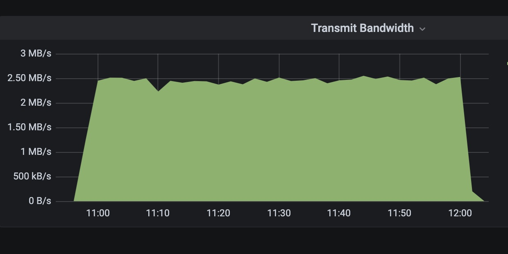
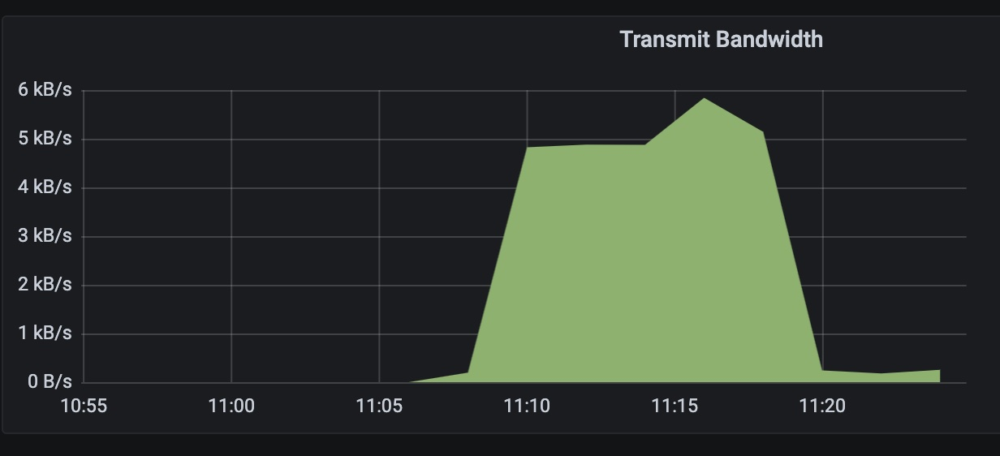

# OpenTelemetry Collector Performance

The measured numbers were generated with version 0.60.0 of the OpenTelemetry Collector. They are primarily applicable to the OpenTelemetry Collector and measured only for traces. In the future, more configurations should be tested.

The performance of the OpenTelemetry Collector depends on a set of factors, including the following:

- CPU and memory allocation
- The type of sampling: Tail-based or head-based sampling
- The receiving format: OpenTelemetry, Jaeger thrift, or Zipkin
- The size of spans

With OpenTelemetry agent, better performance with lower resource utilization is expected, because the OpenTelemetry agent does not support features such as batching, retries, or tail-based sampling.

# Testing

The test was performed on Kyma version 2.6 deployed on Kubernetes version 1.23.9 using the [Synthetic Load Generator utility](https://github.com/Omnition/synthetic-load-generator) running for a minumum of one hour.
Test results are reproducible by using the parameters described in this document. It is important to know that this utility has a few configurable parameters, which can impact the result of the tests.
The parameters used in this test are:

- flushIntervalMillis: 1000
- MaxQueueSize: 100
- Submission rate: 100000 span/sec

OpenTelemetry Collector:
- 1 CPU
- 2 GiB Memory
- Processor memory limiter: 1000 Mib with a spike limit 256 Mib, and an interval check of one second

Test goal is to find a maximum sustained rate with given default configuration and allocated resources (CPU and memory).

The test setup in total reaches 3248176 traces (900 traces/sec.) with total 162408800 spans (45K span/sec.).

|  |
| :--: |
| Fig. 1 CPU utilization |

|  |
| :--: |
| Fig. 2 Memory utilization |

|  |
| :--: |
| Fig. 3 Receive Bandwidth |

|  |
| :--: |
| Fig. 4 Transmit Bandwidth |

|  |
| :--: |
| Fig. 5 Rate of Received Packets |

|  |
| :--: |
| Fig. 6 Rate of Transmitted Packets |

If you use head-based sampling and need higher rates, you can do the following:

- Divide traffic to different collector.
- Scale up by adding more CPU and memory resources; for example, to double the rate, double CPU and memory.
- Scale out by adding one or more collectors behind a load balancer or a Kubernetes service.

If you use tail-based sampling and need higher rates, you can do the following:
- Scale up by adding more CPU and memory resources; for example, to double the rate, double CPU and memory.
- Scale out by adding one or more collectors behind a load balancer or a Kubernetes service. The load balancer must support traceID-based routing, because all spans of a given traceID must be received by the same collector instance.

## Queue Test

To mitigate backend outages, the OpenTelemetry pipelines offer a set of queue and retry mechanisms.
The queue mechanism consists of two stages, one on processor level and one on exporter level.

In this case, on processor level, we use the **batch processor**. The batch processor queue is a pretty simple in-memory queue. It queues spans received from any receiver before they are processed.

The batch processor supports both size- and time-based batching. Batching supports better data compression and reduces the number of outgoing connections required to transmit the data.

You can configure the batch processor queue with the following configuration parameters:

- **send_batch_size**: Number of spans that a single batch can contain, regardless of the timeout.
- **timeout**: Time duration after which a batch is sent, regardless of size.
- **send_batch_max_size**: The upper limit of the batch size. This setting ensures that large batches are split into smaller units. It must be greater or equal to **send_batch_size**.

The second kind of queue is on the exporter level and primarily offers queued retries. This queue also supports a persistent queue mechanism, but this is not part of the test.
The exporter queue queues batches that it receives from the batch processor, and pushes batches to the backed after a configured timeout.

In case of backend outages, a retry mechanism retries export to the backend before batches are dropped from the queue. 
You can configure the retry mechanism with the following configuration parameters:
- **initial_interval**: Time to wait after the first failure before retrying (default 5 seconds).
- **max_interval**: The upper bound of backoff (default 30 seconds).
- **max_elapsed_time**: The maximum amount of time spent trying to send a batch (default 300 seconds).

The test goals is to simulate backend outages and find out a configuration that tolerates outages of 10 minutes (or longer) before it drops traces from the queue.

The test was performed on Kyma version 2.6 deployed on Kubernetes version 1.23.9 using the [Synthetic Load Generator utility](https://github.com/Omnition/synthetic-load-generator) running for a minimum of 15 minutes.

The parameters used in this test are:

- flushIntervalMillis: 1000
- MaxQueueSize: 100
- Submission rate: 5000 span/sec

OpenTelemetry Collector:
- 1 CPU
- 2 GiB memory
- Processor memory limiter disabled to avoid data losses.
- Batch processor queue size configured to 10000 spans and 10 second timeout.
- Exporter queue size configured to 600 batches and max elapsed time to 600 seconds.

The test was executed for approximately 15 minutes. During test execution, 61285 traces (in average 100 traces/second) were generated and sent to the collector; in total 3064250 spans (in average 5000 spans/second). 
All the traces and spans arrived at the collector pipelines and were processed without being successfully pushed to the backend.

The collector deployment memory peaked after approximately 10 minutes (see Figure 8) and started dropping data from the queue.
The CPU utilization stayed moderate during the entire test execution (see Figure 7).

|  |
| :--: |
| Fig. 7 CPU utilization |

|  |
| :--: |
| Fig. 8 Memory utilization |

|  |
| :--: |
| Fig. 9 Receive Bandwidth |

|  |
| :--: |
| Fig. 10 Transmit Bandwidth |

|  |
| :--: |
| Fig. 11 Rate of Received Packets |

|  |
| :--: |
| Fig. 12 Rate of Transmitted Packets |