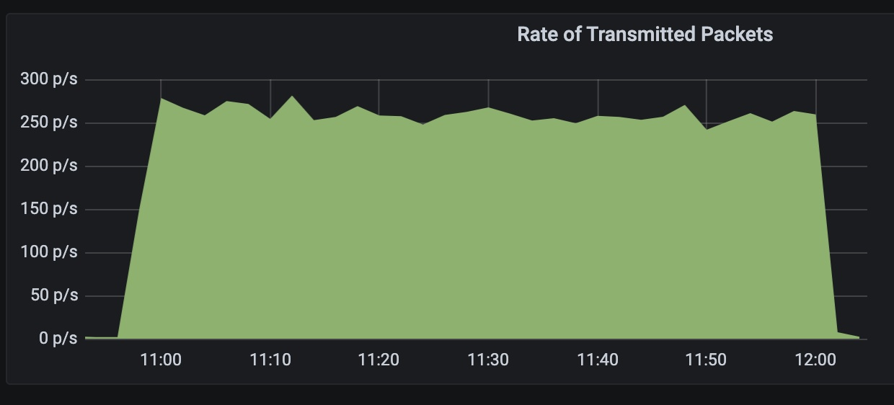

# OpenTelemetry Collector Performance

The measured numbers that generated using version 0.2.5 of the OpenTelemetry Collector, are primarily applicable to the OpenTelemetry Collector and measured only for traces. In the future, more configurations should be tested.

It is important to know, that the performance of the OpenTelemetry Collector depends on a set of factors including:

- CPU / Memory allocation
- The type of sampling: Tail based or head based sampling
- The receiving format: OpenTelemetry, Jaeger thrift or Zipkin
- The size of spans

Please note, with OpenTelemetry agent expected better pefformance with lower resource utilization, since the OpenTelemetry Agent does not support features such as batching or retries and no tail based sampling supported yet.

# Testing

Test was performed on Kyma version 2.6 deployed on Kubernetes version 1.23.9 using the [Synthetic Load Generator utility](https://github.com/Omnition/synthetic-load-generator) running for a minumum of one hour.
Test results are reproducible by using the parameters described in this document. It is important to know that this utility has a few configurable parameters, which can impact the result of the tests.
The parameters used in this test are:

- flushIntervalMillis: 1000
- MaxQueueSize: 100
- Submission rate: 100000 span/sec

OpenTelemetry Collector:
- 1 CPU
- 2 GiB Memory
- Processor memory limiter: 1000 Mib with a spike limit 256 Mib, and an interval check of one second.

Test goal is, find a maximum sustained rate with given default configuration and allocated resources (CPU and Memory).

Test setup in total reach 3248176 (900 traces/sec.) traces with total 162408800 (45K span/sec.) spans.

|  |
| :--: |
| Fig. 1 CPU utilization |

|  |
| :--: |
| Fig. 2 Memory utilization |

|  |
| :--: |
| Fig. 3 Receive Bandwidth |

|  |
| :--: |
| Fig. 4 Transmit Bandwidth |

|  |
| :--: |
| Fig. 5 Rate of Received Packets |

|  |
| :--: |
| Fig. 5 Rate of Transmitted Packets |

With using head based sampling, when higher rates needed, either:

- Divide traffic to different collector
- Scale-up by adding more CPU/Memory resources (doubling CPU and Memory will result two time more rate).
- Scale-out by adding one or more collector behind a load balancer or a Kubernetes service.

With tail based sampling either:
- Scale-up by adding more CPU/Memory resources (doubling CPU and Memory will result two time more rate).
- Scale-out by adding one or more collector behind a load balancer or a Kubernetes service, but the load balancer have to support **traceID-based** routing because all span of a given traceID need to be received by the dame collector instance.