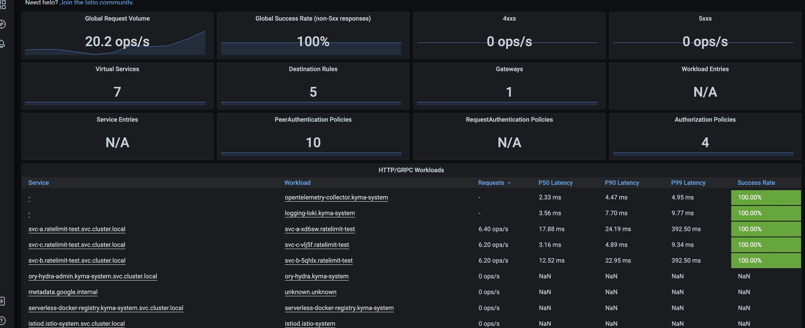

# OpenTelemetry/Istio Sampling Rate Analysis

This analysis aim to find out impact of different sampling rate configuration on istio proxy and overall call chain.

Different scenarios should be compared end of analysis, like istio resource consumption, throughput, and impact of other kubernetes components. 

## Setup
### Opentelemetry
OpenTelemetry version 0.22.1 deployed on a Kyma cluster (version 2.6.0) with a minimal setup,
minimal setup mean :
- Standard deployment of OpenTelemetry Helm Chart version 0.22.1
- As receivers standard Jaeger, Zipkin, and OTLP configured
- As processor only memory limiter processor with standard configuration
- As exporter only log/info and/or NOP exporter to keep impact of OpenTelemetry as low as possible
- No andy additional extensions

### Sampling App Deployment

As sampling app, 3 serverless function deployed with istio sidecar injected and which calling each other in a chain like
**Extern Call -> FunctionA -> FunctionB -> FunctionC** to simulate a trace fully sampled with an external call.

All functions are deployed with NodeJs version 16.

### Call Simulator
As call simulator Gatling version 3.8.3 used.

## Scenario
All scenarios are having same OpenTelemetry deployment and configuration described above.

Same Sampling app used in all scenarios.

Same Gatling call simulator used in all scenarios, Gatling shall call **FunctionA** from extern with at least 5 simultaneous users up to 10 maximum.
Call is simple URL call of FunctionA with no additional data or http headers to keep any influence of those on trace self.

Call simulation should run 100 minutes long to put enough load on call chain and generate enough metrics to get precise result.

### Scenario 1
Kyma standard (version 2.6.0) deployment with istio sampling rate configured to **1%** sampling, to observe istio behavior like resource consumption and throughput.

### Scenario 2 
Kyma standard deployment from main branch with istio sampling rate configuration changed to **100%** sampling, to observe istio behavior like resource consumption and throughput.

### Scenario 3
Like **Scenario 2** described above with additional configuration on **Jaeger** and **Zipkin** receivers services without endpoint.

Services **Jaeger** and **Zipkin** in this scenario are exist but pointing no valid endpoint. This scenario should focus additionally impact on kubernetes components.

### Scenario 4

Like Scenario 2 described above, this setup should run without collectors **Jaeger** and **Zipkin** to analyse istio behaviour and impact on kubernetes components like **CoreDNS**.

## Result

Overall analysis focus on istio behavior and resource consumption under different configuration and setup, in **Scenario 3** and **Scenario 4** additionally focus on kubernetes components.

### Scenario 1

