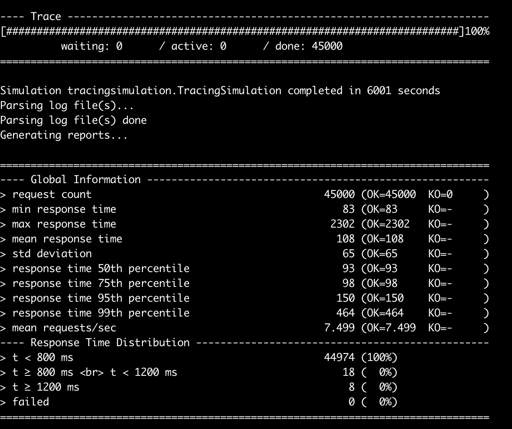
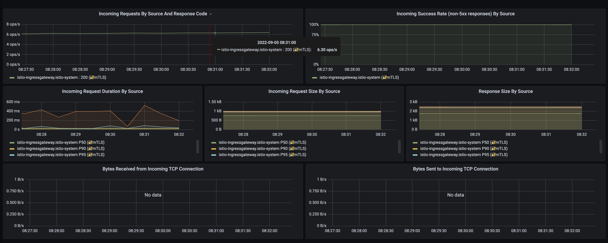
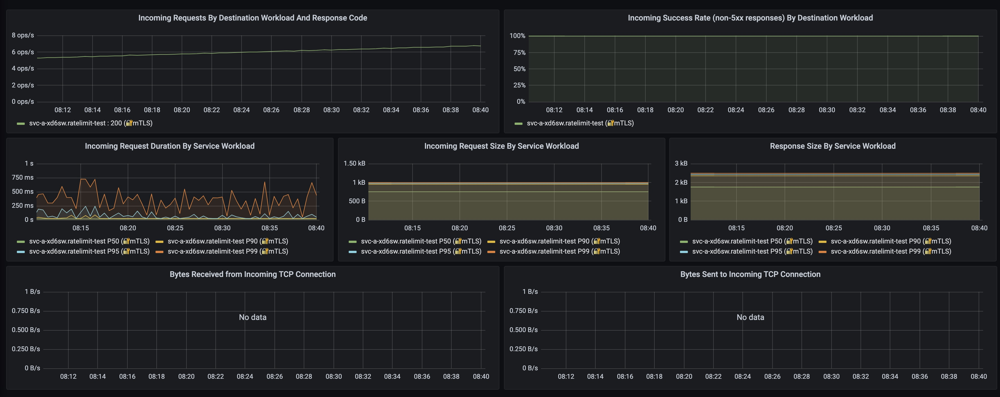

# OpenTelemetry/Istio Sampling Rate Analysis

This analysis aims to find out the impact of different sampling rate configurations on the Istio proxy and overall call chain.

At the end of the analysis, different scenarios are compared, like Istio resource consumption, throughput and impact of other Kubernetes components. 

## Setup
### OpenTelemetry
OpenTelemetry version 0.22.1 deployed on a Kyma cluster (version 2.6.0) with the following minimal setup:
- Standard deployment of OpenTelemetry Helm Chart version 0.22.1
- As receivers, standard Jaeger, Zipkin, and OTLP configured
- As processor, only a memory limiter processor with standard configuration
- As exporter, only log/info and/or NOP exporter to keep impact of OpenTelemetry as low as possible.
- No additional extensions

### Sampling App Deployment

As sampling app, three serverless Functions are deployed with Istio sidecar injected. To simulate a trace fully sampled with an external call, the Functions call each other in the following chain:
**Extern Call -> FunctionA -> FunctionB -> FunctionC**

All Functions are deployed with NodeJs version 16.

### Call Simulator
As call simulator, Gatling version 3.8.3 is used.

## Scenarios

This test compares the following scenarios:

- **Scenario 1** with 1% sampling rate
- **Scenario 2** with 100% sampling rate
- **Scenario 3** with 100% sampling rate, collector service without end point
- **Scenario 4** with 100% sampling rate, no collector deployed

See the following sections for details about the test setup:

### Common Setup

The following setup is identical across all scenarios:

* OpenTelemetry deployment and configuration (see [Setup](#setup))

* Sampling app

* Call simulator "Gatling" calls **FunctionA** from external, with 5-10 simultaneous users.
  The call is a simple URL call of FunctionA with no additional data or http headers to keep any influence of those on the trace itself.
  The call simulation runs for 100 minutes to put enough load on the call chain and generate enough metrics to get precise results.
### Scenario 1
Kyma standard deployment (version 2.6.0), with Istio sampling rate configured to **1%** sampling, to observe Istio behavior like resource consumption and throughput.

### Scenario 2 
Kyma standard deployment from main branch, with Istio sampling rate configuration changed to **100%** sampling, to observe Istio behavior like resource consumption and throughput.

### Scenario 3
Like **Scenario 2** with additional configuration on **Jaeger** and **Zipkin** receiver services without a valid endpoint. This scenario investigates additional impact on Kubernetes components.

### Scenario 4

Like Scenario 2, Scenario 4 runs without collectors **Jaeger** and **Zipkin** to analyze Istio behavior and impact on Kubernetes components like **CoreDNS**.

## Result

The overall analysis focuses on Istio behavior and resource consumption under different setups. In **Scenario 3** and **Scenario 4**, there's additional focus on Kubernetes components.
### Scenario 1

Fig. 1 shows the call execution summary (from client perspective) of the test cluster with Istio sampling rate set to **1%**. 
The success rate of call execution is 100%, and the average response time is around **400ms**.

|  |
| :--: |
| Fig. 1 Call execution summary |

Fig. 2 shows the Istio Mesh overview. Like for the call execution summary, the success rate of cluster metrics is 100%, including local call chain.
Average latency stays around 400ms, with 6.5 operations per second per service.

|  |
| :--: |
| Fig. 2 Istio Mesh Overview |

|  |
| :--: |
| Fig. 3 Istio Service Overview |

|  |
| :--: |
| Fig. 4 Service Network Details |

|  |
| :--: |
| Fig. 5 Service Network Details |

Fig. 6 shows the Istio proxy resource consumption. During the test phase, the transferred amount of data increased from around 10KB/s to 60KB/s in peak time.

Memory consumption of the Istio proxy increased from 61 MB to 68.7 MB in the peak time. CPU consumption increased from 0.100 before the test started, to around 0.150 in peak time.

Although resource consumption during test execution increased, there was no considerable resource consumption observed.

|  |
| :--: |
| Fig. 6 Istio Proxy Resource Consumption |

Fig. 7 shows an overview of the Kubernetes CoreDNS service. Nothing noticeable was observed.

During test execution, DNS requests per second increased from 2 packet/sec to 3.5 packet/sec; and DNS lookups increased as well. 

Fig. 8 shows an overview on the cache. Cache hits are increased, which indicates that DNS record request results are mostly caused by cache.

|  |
| :--: |
| Fig. 7 Kubernetes CoreDNS Overview |

|  |
| :--: |
| Fig. 8 Kubernetes CoreDNS Cache |

#### Summary
The test results show that there is a small, but overall negligible, impact on the Istio proxy.
For Kubernetes CoreDNS, no suspicious behavior was observed. DNS requests increased from 2 to 3 requests per second, and DNS lookups increased from 1 to 2 per second. DNS cache hits increased in parallel to the DNS lookup responses, which proves that lookup requests mostly hit the cache.

### Scenario 2

Fig. 1 shows the call execution summary (from client perspective) of the test cluster with Istio sampling rate set to **100%**. 
The success rate of call execution is 99%, and the average response time is around **950ms**.

Unsuccessful calls mostly result in a HTTP 503 response; with the main cause being that Istio proxy can't access either the upstream service (the serverless function), or the Jaeger tracing collector service.

|  |
| :--: |
| Fig. 1 Call execution summary |

Fig. 2 shows the Istio Mesh network overview. Like for the call execution summary, the success rate of cluster metrics is 100%, including local call chain.
Average latency stays over 500ms, with 6.7 operations per second per service.

Global Request Volume increased from 10 to 65.8 operations per second, which indicates high traffic on the Istio mesh.

|  |
| :--: |
| Fig. 2 Istio Mesh Overview |

|  |
| :--: |
| Fig. 3 Istio Service Overview |

|  |
| :--: |
| Fig. 4 Service Network Details |

|  |
| :--: |
| Fig. 5 Service Network Details |

Fig. 6 shows the Istio proxy resource consumption. During the test phase, the transferred amount of data increased from around 10KB/s to 300KB/s in peak time.

Memory consumption of the Istio proxy increased from 61 MB to 68.7 MB in the peak time. CPU consumption increased from 0.100 before the test started, to around 0.170 in peak time.

Although resource consumption during test execution increased, there are no considerable resource consumption observed.

|  |
| :--: |
| Fig. 6 Istio Proxy Resource Consumption |

Fig. 7 shows an overview of the Kubernetes CoreDNS service. For Kubernetes CoreDNS, no suspicious behavior was observed.
During test execution, DNS requests per second increased from 2 packet/sec to 3.3 packet/sec; and DNS lookups increased as well.

Fig. 8 shows the DNS Cache overview. DNS cache hits increased in parallel to the DNS lookup requests, which indicates that DNS record request results are mostly caused by cache.

|  |
| :--: |
| Fig. 7 Kubernetes CoreDNS Overview |

|  |
| :--: |
| Fig. 8 Kubernetes CoreDNS Cache |

#### Summary
Scenario 2 results show that there is a small impact on the Istio proxy.

Kubernetes CoreDNS service metrics show no suspicious behavior. DNS record request and DNS lookups mostly read from the DNS cache.

The test shows a 100% sampling rate; in certain circumstances, increased overall network traffic can cause increased network latency and some networking issues.

### Scenario 3

Fig. 1 shows the call execution summary (from client perspective) of the test cluster with Istio sampling rate set to **100%**. 

Different to **Scenario 2**, the Jaeger tracing collector service has no working endpoint in this scenario.

The success rate of call execution is 33%, and the average response time is around **9 seconds**.

Unsuccessful calls mostly result in a HTTP 503 response because upstream services can't access the Jaeger tracing collector service.

|  |
| :--: |
| Fig. 1 Call execution summary |

Fig. 2 shows the Istio Mesh network overview. Like for the call execution summary, the success rate of cluster metrics is 33%, including local call chain.

Average latency stays over 951ms, with 7 operations per second per service.

Global Request Volume increased from 10 to 72.8 operations per second, which indicates high traffic on the Istio mesh.

|  |
| :--: |
| Fig. 2 Istio Mesh Overview |

|  |
| :--: |
| Fig. 3 Istio Service Overview |

|  |
| :--: |
| Fig. 4 Service Network Details |

|  |
| :--: |
| Fig. 5 Service Network Details |

Fig. 6 shows the Istio proxy resource consumption. During the test phase, the transferred data amount increased from around 10KB/s to 180KB/s in peak time.

Memory consumption of the Istio proxy increased from 61 MB to 67 MB in the peak time. CPU consumption increased from 0.100 before the test started, to around 0.140 in peak time.

Compared to **Scenario 2**, the transferred amount of data decreased by almost 50%, which is related to the fact that no tracing data could be transferred to the Jaeger tracing collector.

|  |
| :--: |
| Fig. 6 Istio Proxy Resource Consumption |

Fig. 7 shows an overview of the Kubernetes CoreDNS service. Compared to **Scenario 2**, DNS request and DNS lookup response times are more than doubled.

The same behavior is observable for the DNS cache metrics: Compared to **Scenario 2**, the cache misses are almost doubled.

|  |
| :--: |
| Fig. 7 Kubernetes CoreDNS Overview |

|  |
| :--: |
| Fig. 8 Kubernetes CoreDNS Cache |

#### Summary

Compared to **Scenario 2**, the overall network latency is bad, response times increased from below 1 second up to 9 seconds.

The same behavior is observable for the CoreDNS service: Compared to **Scenario 2**, DNS requests and DNS lookup times increased by up to 100%.

### Scenario 4

Fig. 1 shows the call execution summary (from client perspective) of the test cluster with Istio sampling rate set to **100%**.
The success rate of call execution is 99%, and the average response time is around **1 second**.

Unsuccessful calls mostly result in a HTTP 503 response; with the main causes being high network latency and high load to the upstream service.

|  |
| :--: |
| Fig. 1 Call execution summary |

Fig. 2 shows the Istio Mesh network overview. Like for the call execution summary, the success rate of cluster metrics is 100%, including local call chain.
Average latency stays over 727ms, with 7.30 operations per second per service.

Global Request Volume increased from 10 to 21.1 operations per second. Compared to **Scenario 2** and **Scenario 3**, which have more than 65 operations per second, here the calls to the tracing collector service are missing.

|  |
| :--: |
| Fig. 2 Istio Mesh Overview |

|  |
| :--: |
| Fig. 3 Istio Service Overview |

|  |
| :--: |
| Fig. 4 Service Network Details |

|  |
| :--: |
| Fig. 5 Service Network Details |

Fig. 6 shows the Istio proxy resource consumption. During the test phase, the transferred amount of data increased from around 10KB/s to 77KB/s in peak time.

Memory consumption of the Istio proxy increased from 66 MB to 67 MB in the peak time. CPU consumption increased from 0.050 before the test started, to around 0.100 in peak time.

At test start, memory consumption and CPU consumption increased rapidly, but within 5 minutes, they decreased to the normal values.

Compared to **Scenario 2** and **Scenario 3**, the transferred amount of data decreased significantly decreased, which is related to the missing tracing collector service calls.

|  |
| :--: |
| Fig. 6 Istio Proxy Resource Consumption |

Fig. 7 shows an overview of the Kubernetes CoreDNS service. 
Like in **Scenario 3**, the DNS requests per second increased significantly, from 2 packet/sec to 8 packet/sec.
During test execution, DNS cache misses also doubled, which also explains the increased DNS lookup response time. DNS lookup response time increased from 1 second to 4 seconds, and response times went up to 500ms.

|  |
| :--: |
| Fig. 7 Kubernetes CoreDNS Overview |

|  |
| :--: |
| Fig. 8 Kubernetes CoreDNS Cache |

#### Summary

Kubernetes CoreDNS service lookup times and DNS requests increased significantly, and the overall network latency increased.

### Conclusion

The following table compares the metrics for all four scenarios.

- **Scenario 1** with 1% sampling rate
- **Scenario 2** with 100% sampling rate
- **Scenario 3** with 100% sampling rate, collector service without end point
- **Scenario 4** with 100% sampling rate, no collector deployed

||Scenario 1|Scenario 2|Scenario 3|Scenario 4|
|:--|:--:|:--:|:--:|:--:|
|Success Rate|100%|99%|33%|99%|
|Global Request (Mesh)|20.2 ops/s|65.8 ops/s|72.8 ops/s|21.1 ops/s|
|Request per Service|6.20 ops/s|6.70 ops/s|7.20 ops/s|7.33 ops/s|
|Latency|400ms|950ms|9 sec|1 sec|
|Bytes Transferred|60KB/s|300KB/s|170KB/s|70KB/s|
|DNS Requests|3 p/s|3 p/s|8 p/s|8 p/s|
|DNS Lookups|150ms|150ms|500ms|700ms|

A 100% sampling rate puts more pressure on the overall network communication, causing high latency and high load on collector services.

Deployment without collectors (or a broken collector service) causes pressure on the Kubernetes CoreDNS service; DNS requests and DNS lookups increase up to 400% compared to scenarios with working collectors.