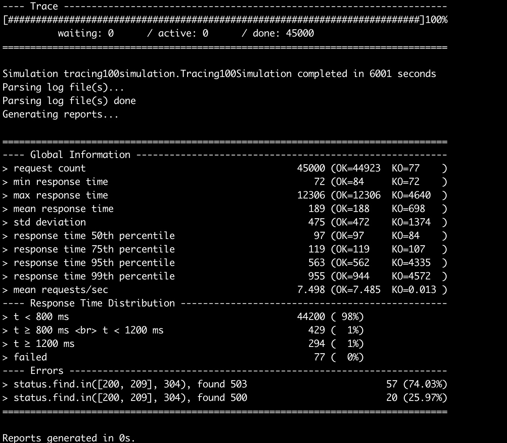
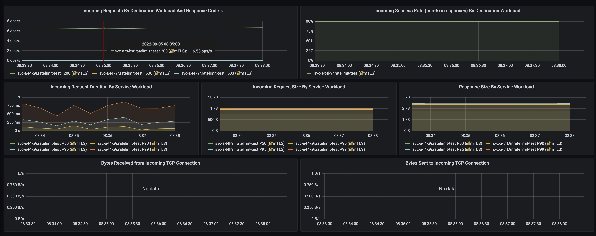
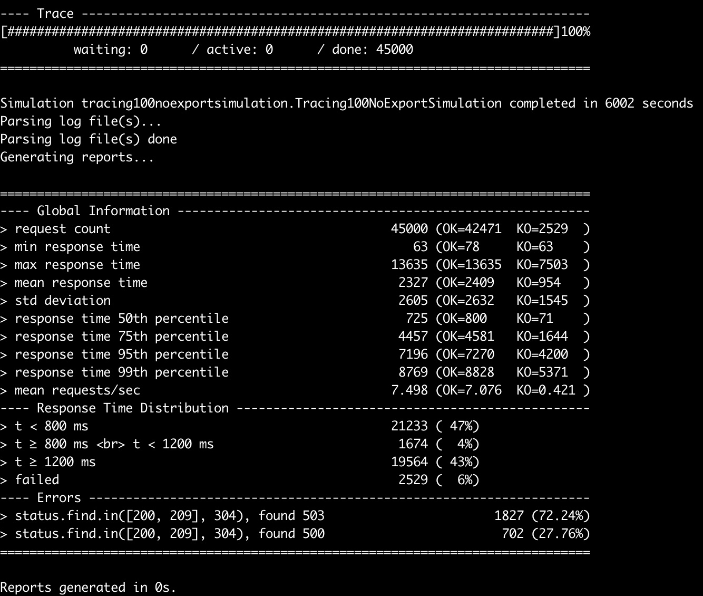
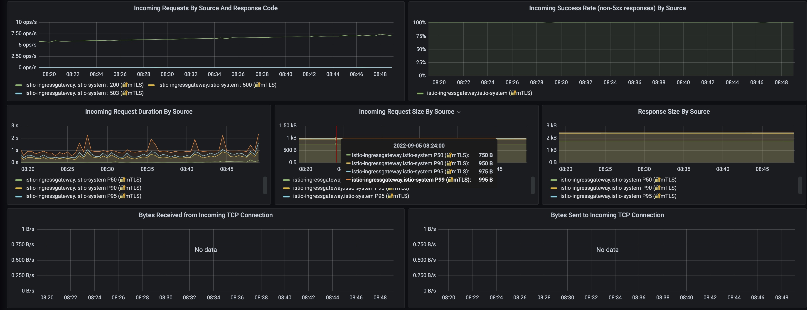
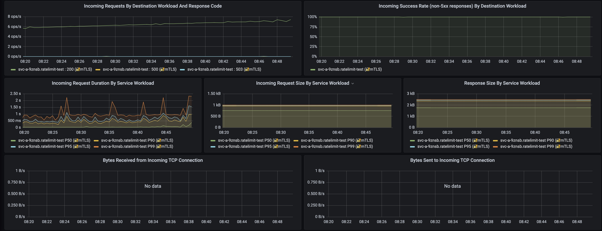
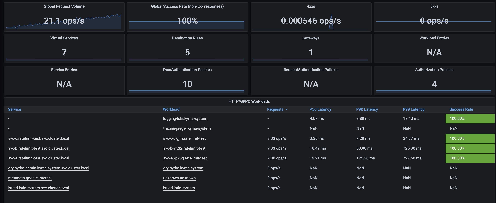

# OpenTelemetry/Istio Sampling Rate Analysis

This analysis aims to find out the impact of different sampling rate configuration on the Istio proxy and overall call chain.

At the end of the analysis, different scenarios are compared, like Istio resource consumption, throughput, and impact of other Kubernetes components. 

## Setup
### OpenTelemetry
OpenTelemetry version 0.22.1 deployed on a Kyma cluster (version 2.6.0) with the following minimal setup:
- Standard deployment of OpenTelemetry Helm Chart version 0.22.1
- As receivers, standard Jaeger, Zipkin, and OTLP configured
- As processor, only a memory limiter processor with standard configuration
- As exporter, only log/info and/or NOP exporter to keep impact of OpenTelemetry as low as possible
- No any additional extensions

### Sampling App Deployment

As sampling app, three serverless Functions are deployed with Istio sidecar injected. To simulate a trace fully sampled with an external call, the Functions call each other in the following chain:
**Extern Call -> FunctionA -> FunctionB -> FunctionC**

All Functions are deployed with NodeJs version 16.

### Call Simulator
As call simulator Gatling version 3.8.3 used.

## Scenario
### Common Setup

The following setup is identical across all scenarios:

* OpenTelemetry deployment and configuration (see [Setup](#setup))

* Sampling app

Same Gatling call simulator used in all scenarios, Gatling shall call **FunctionA** from extern with at least 5 simultaneous users up to 10 users maximum.

Gatling will generate around 50K call towards to FunctionA, istio proxy of deployed functions will call tracing collectors for each call should be sampled

### Scenario 1
Kyma standard deployment (version 2.6.0) with Istio sampling rate configured to **1%** sampling, to observe Istio behavior like resource consumption and throughput.

### Scenario 2 
Kyma standard deployment from main branch with Istio sampling rate configuration changed to **100%** sampling, to observe Istio behavior like resource consumption and throughput.

### Scenario 3
Like **Scenario 2** with additional configuration on **Jaeger** and **Zipkin** receiver services without valid endpoint. This scenario should investigates additional impact on Kubernetes components.

### Scenario 4

Like Scenario 2, runs without collectors **Jaeger** and **Zipkin** to analyse Istio behaviour and impact on Kubernetes components like **CoreDNS**.

## Result

The overall analysis focuses on Istio behavior and resource consumption under different setups. In **Scenario 3** and **Scenario 4**, there's additional focus on Kubernetes components.
### Scenario 1

Following picture shown call execution summary (from client perspective) of test cluster with istio sampling rate 1% setup. 
Success rate of call execution is 100% and average response time is around **400ms.**

|  |
| :--: |
| Fig. 1 Call execution summary |

Screenshot below show overview istio mesh network, as call execution summary cluster metrics also show 100% of success rate inclusive local call chain.
Latency on average stay around 400ms with a 6.5 operation per second per service.

|  |
| :--: |
| Fig. 2 Istio Mesh Overview |

|  |
| :--: |
| Fig. 3 Istio Service Overview |

|  |
| :--: |
| Fig. 4 Service Network Details |

|  |
| :--: |
| Fig. 5 Service Network Details |

Screenshot below show istio proxy resource consumption during test, bytes transfered during test phase increased from around 10KB/s to 60KB/s in peak time.

Memory consumtion of istio proxy increased from 61MB to 68.7 MB in peak time, on CPU consumption side, before test started was 0.100 in peak time the value increased to around 0.150.

Although resource consumtion during test execution increased, there are no considarable resource consumption observed.

|  |
| :--: |
| Fig. 6 Istio Proxy Resource Consumption |

On Kubernetes CoreDNS service side nothing important to mention here, screenshots below shown an overview.

DNS request per second increase during test execution from 2 packet/sec. to 3.5 packet/sec. also DNS lookups increased. 

DNS Cache overview show cache hits are increased which indicate DNS records request results are mostly coming from cache.

|  |
| :--: |
| Fig. 7 Kubernetes CoreDNS Overview |

|  |
| :--: |
| Fig. 8 Kubernetes CoreDNS Cache |

#### Summary
Test results shown there is a small impact on istio proxy but none of those are overall considerably.
On Kubernetes CoreDNS side no suspicion behavior observed, DNS request are increased from 2 to 3 request per second, DNS lookups increased from 1 to 2 per second, and 
DNS cache hits increased parallel to the DNS lookup responses, which indicate lookups request hit mostly cache.

### Scenario 2

Following picture shown call execution summary (from client perspective) of test cluster with istio sampling rate 100% setup.
Success rate of call execution is 99% and average response time is around **950ms.** 

Unsuccessfully calls mostly result HTTP 503, main cause of not successfully calls are, either istio proxy can't access upstream service (serverless function self) or jaeger tracing collector service,
which result both upstream services (serverless function and jaeger) are can't deal such load but on istio proxy side noting suspicion observed.  

|  |
| :--: |
| Fig. 1 Call execution summary |

Screenshot below show overview istio mesh network, as call execution summary cluster metrics also show 100% of success rate inclusive local call chain.
Latency on average stay over 500ms with a 6.7 operation per second per service.

Global Request Volume increased from 10 to 65.8 operation per second which indicate high traffic on istio side.

|  |
| :--: |
| Fig. 2 Istio Mesh Overview |

|  |
| :--: |
| Fig. 3 Istio Service Overview |

|  |
| :--: |
| Fig. 4 Service Network Details |

|  |
| :--: |
| Fig. 5 Service Network Details |

Screenshot below show istio proxy resource consumption during test, bytes transferred during the test execution time increased from around 10KB/s to 300KB/s in peak time.

Memory consumption of istio proxy increased from 61MB to 68.7 MB in peak time, on CPU consumption side, before test started was 0.100 in peak time the value increased to around 0.170.

Although resource consumption during test execution increased, there are no considerable resource consumption observed.

|  |
| :--: |
| Fig. 6 Istio Proxy Resource Consumption |

On Kubernetes CoreDNS service side nothing important observed, screenshots below shown an overview on CoreDNS service.
DNS request per second increase during the test execution time from 2 packet/sec. to 3.3 packet/sec. also DNS lookups increased.

DNS Cache overview show cache hits are increased parallel to DNS lookup request which indicate DNS records request results are mostly coming from cache.

|  |
| :--: |
| Fig. 7 Kubernetes CoreDNS Overview |

|  |
| :--: |
| Fig. 8 Kubernetes CoreDNS Cache |

#### Summary
Test results shown there is a small impact on istio proxy but none of those are overall considerably.
On Kubernetes side look good, CoreDNS service side is no considerable DNS record request observed and DNS records mostly read from DNS cache.

Test shown 100% sampling rate, increase overall network traffic, in certain circumstances can cause increased network latency and some networking issues.

### Scenario 3

Following picture shown call execution summary (from client perspective) of test cluster with istio sampling rate 100% setup.
Success rate of call execution is 33% and average response time is around **9 seconds.**

Unsuccessfully calls mostly result HTTP 503 because of upstream services can't access Jaeger tracing collector.

|  |
| :--: |
| Fig. 1 Call execution summary |

Screenshot below show overview istio mesh network, as call execution summary cluster metrics also show 33% of success rate inclusive local call chain.
Latency on average stay over 951ms with a 7 operation per second per service.

Global Request Volume increased from 10 to 72.8 operation per second which indicate high traffic on istio mesh.

|  |
| :--: |
| Fig. 2 Istio Mesh Overview |

|  |
| :--: |
| Fig. 3 Istio Service Overview |

|  |
| :--: |
| Fig. 4 Service Network Details |

|  |
| :--: |
| Fig. 5 Service Network Details |

Screenshot below show istio proxy resource consumption during the test execution time, bytes transferred during test phase increased from around 10KB/s to 180KB/s in peak time.

Memory consumption of istio proxy increased from 61MB to 67 MB in peak time, on CPU consumption side, before test started was 0.100 in peak time the value increased to around 0.140.

Compare to the test **Scenario 2** amount of data transferred is almost 50% decreased which show no tracing data could be transferred to the tracing collectors.

Although resource consumption during test execution increased, there are no considerable resource consumption observed.

|  |
| :--: |
| Fig. 6 Istio Proxy Resource Consumption |

Kubernetes CoreDNS service show increased DNS request and DNS lookup response time, to compared with **Scenario 2**
DNS request and DNS lookup response times are more than doubled.

Same behavior also observable on DNS cache metrics side, cache misses almost doubled to compared with **Scenario 2**.

|  |
| :--: |
| Fig. 7 Kubernetes CoreDNS Overview |

|  |
| :--: |
| Fig. 8 Kubernetes CoreDNS Cache |

#### Summary
Overall network latency resulted bad to compare to **Scenario 2**, response times increased from just below 1 second up to 9 second.
Same behavior observable on Kubernetes CoreDNS side, DNS requests and DNS lookups times increased up to 100% to compared with **Scenario 2**

### Scenario 4

Fig.1 shown call execution summary (from client perspective) of test cluster with istio sampling rate 100% setup.
Success rate of call execution is 99% and average response time is around **1 seconds.**

Unsuccessfully calls mostly result HTTP 503, main cause was high network latency and high load to the upstream service. 

|  |
| :--: |
| Fig. 1 Call execution summary |

Fig. 2 below show overview istio mesh network, as call execution summary cluster metrics also show 100% of success rate inclusive local call chain.
Latency on average stay over 727ms with a 7.30 operation per second per service.

Global Request Volume increased from 10 to 21.1 operation per second, compared to the **Scenario 2** and **Scenario 3** with Global operation per second value over 65, here missing calls to the tracing collector service calls.

|  |
| :--: |
| Fig. 2 Istio Mesh Overview |

|  |
| :--: |
| Fig. 3 Istio Service Overview |

|  |
| :--: |
| Fig. 4 Service Network Details |

|  |
| :--: |
| Fig. 5 Service Network Details |

Fig. 6 below show istio proxy resource consumption during the test execution time, bytes transferred during entire test increased from around 10KB/s to 77KB/s in the peak time.

Memory consumption of istio proxy increased from 66MB to 67 MB in peak time, CPU consumption, before test started was 0.050 in the peak time the value increased to around 0.100.

By test start, memory consumption as well as CPU consumption increased rapidly but decreased in 5 minutes to the normal values.

Data amount transferred with in the mesh compared to previous scenarios **Scenario 2** and **Scenario 3** significantly decreased,
which to lead back missing tracing collector service calls.

|  |
| :--: |
| Fig. 6 Istio Proxy Resource Consumption |

Like **Scenario 3** Kubernetes CoreDNS service side DNS request per second increased significantly, from 2 packet per second to 8 packet per second.
DNS cache misses also doubled in the test execution time, which also explain increased DSN lookup response time, this value increased from 1 second to 4 seconds and response times up to 500ms during test execution time.

|  |
| :--: |
| Fig. 7 Kubernetes CoreDNS Overview |

|  |
| :--: |
| Fig. 8 Kubernetes CoreDNS Cache |

#### Summary

CoreDNS service lookup times and DNS requests are increased significantly, overall network latency increased. 

### Conclusion

TBD